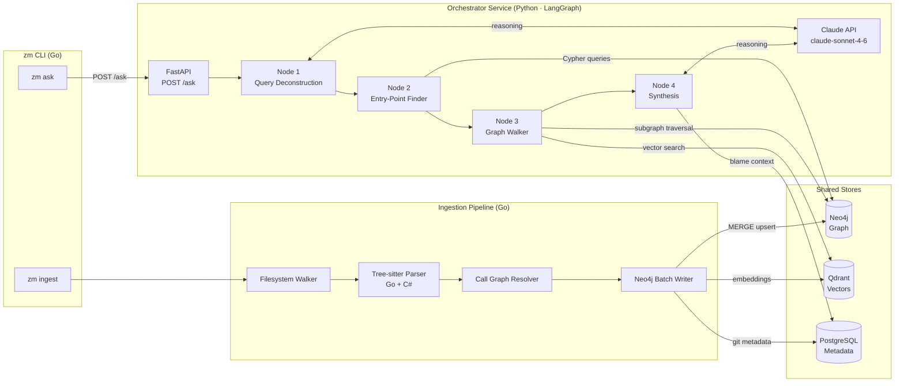

# Azimuth — The Codebase Oracle

An AI-native developer tool that treats your codebase as a **Living Knowledge Graph** — answering *"How"*, *"Where"*, and *"Why"* questions using AST structure, call graphs, and Git history.

Unlike standard RAG which treats code as flat text, Azimuth synthesises three layers:

| Layer | Store | What it captures |
|---|---|---|
| **Structural** | Neo4j | Functions, classes, interfaces, call edges, inheritance |
| **Semantic** | Qdrant | Meaning and intent of code blocks via embeddings |
| **Historical** | PostgreSQL | Who changed what, when, and why (Git blame + commit messages) |

---

## Architecture

Azimuth uses a **CQRS split**: Go owns the write path (ingestion), Python LangGraph owns the read path (query). The two services communicate only through the shared stores — no runtime inter-service calls.



### Data flow

```
Write:  zm ingest <repo>  →  Go pipeline  →  [Neo4j · Qdrant · PostgreSQL]
Read:   zm ask "<query>"  →  Go HTTP client  →  Python LangGraph  →  [Neo4j · Qdrant · PostgreSQL]
```

The only coupling between Go and Python is the **Neo4j graph schema** — documented in [`/doc/graph-schema.md`](/doc/graph-schema.md).

---

## Prerequisites

| Tool | Version | Purpose |
|---|---|---|
| Go | 1.23+ | Ingestion pipeline + CLI binary |
| Python | 3.12+ | LangGraph orchestrator service |
| Docker + Compose | v2+ | Local infrastructure |
| `golangci-lint` | 1.59+ | Go linting |

---

## Quick Start

### 1. Configure environment

```bash
cp .env.example .env
# Required: NEO4J_PASSWORD, POSTGRES_PASSWORD, ANTHROPIC_API_KEY
```

### 2. Start infrastructure

```bash
make infra-up          # Neo4j · Qdrant · PostgreSQL
make health            # confirm all stores reachable
```

### 3. Build the CLI

```bash
make build             # → ./bin/zm
./bin/zm --help
```

### 4. Start the orchestrator (for zm ask)

```bash
cd orchestrator && pip install -e ".[dev]"
make orchestrator-up   # starts the Python FastAPI service on :8000
```

### 5. Ingest a repository

```bash
./bin/zm ingest /path/to/your/repo
# or restrict to one language:
./bin/zm ingest --language go /path/to/your/repo
# or preview without writing:
./bin/zm ingest --dry-run /path/to/your/repo
```

### 6. Ask a question

```bash
./bin/zm ask "Where is the payment handler?"
./bin/zm ask "How does the retry logic work in the order service?" --verbose
./bin/zm ask "Where is the auth middleware?" --json
```

---

## Directory Layout

```
azimuth/
├── cmd/zm/                     # Go binary entry point
├── internal/
│   ├── cli/                    # Cobra commands (ingest, ask, status)
│   ├── ingestion/              # Tree-sitter parsing, call graph extraction
│   ├── graph/                  # Neo4j schema, batch writer, Cypher queries
│   └── config/                 # Layered config loader (defaults → YAML → env)
├── orchestrator/               # Python LangGraph service
│   ├── orchestrator/
│   │   ├── main.py             # FastAPI app (POST /ask, GET /healthz)
│   │   ├── agent.py            # LangGraph StateGraph
│   │   ├── nodes/              # Agent nodes 1–4
│   │   ├── llm/                # Anthropic SDK client with retry
│   │   ├── graph/              # Neo4j read-only client + Cypher queries
│   │   └── schemas.py          # Pydantic request/response models
│   ├── tests/
│   ├── pyproject.toml
│   └── Dockerfile
├── doc/
│   └── graph-schema.md         # Neo4j schema — shared contract between Go and Python
├── tests/                      # Go integration tests (-tags integration)
├── scripts/health_check.sh     # Pre-ingestion store reachability check
├── docker-compose.yml          # Neo4j · Qdrant · PostgreSQL · Orchestrator
├── .env.example                # All required env vars documented
└── config.example.yaml         # Example YAML config
```

---

## Make Targets

### Go (ingestion + CLI)

| Target | Description |
|---|---|
| `make build` | Compile `zm` to `./bin/zm` (version injected from git tag) |
| `make test` | Run Go unit tests |
| `make test-integration` | Run Go integration tests (requires running infra) |
| `make lint` | Run `golangci-lint` |
| `make run` | Run CLI via `go run` |
| `make benchmark` | Run Go benchmarks |

### Infrastructure

| Target | Description |
|---|---|
| `make infra-up` | Start Neo4j, Qdrant, PostgreSQL (waits for healthy) |
| `make infra-down` | Stop all services |
| `make infra-reset` | **Destroy volumes** and restart (dev only) |
| `make health` | Confirm all three stores are reachable |
| `make db-migrate` | Apply pending PostgreSQL migrations |

### Orchestrator (Python)

| Target | Description |
|---|---|
| `make orchestrator-up` | Build and start the Python service on `:8000` |
| `make orchestrator-down` | Stop the orchestrator container |
| `make orchestrator-test` | Run Python unit tests via `pytest` |

---

## Configuration

All configuration is layered: **built-in defaults → `config.yaml` → environment variables**.

Copy `.env.example` to `.env` and fill in the required values:

```dotenv
# Required
NEO4J_PASSWORD=changeme
POSTGRES_PASSWORD=changeme
ANTHROPIC_API_KEY=sk-ant-...

# Optional overrides
ANTHROPIC_MODEL=claude-sonnet-4-6   # default model for the orchestrator
ORCHESTRATOR_URL=http://localhost:8000  # consumed by zm ask
LOG_LEVEL=info                          # debug | info | warn | error
GRAPH_WALKER_DEPTH=3                    # how many hops to traverse in zm ask
```

Full variable reference: [`.env.example`](.env.example)

---

## CLI Reference

### `zm ingest <repo-path>`

Index a repository into the knowledge graph.

```
Flags:
  --dry-run        Parse and extract without writing to any store
  --language       Restrict to a single language: go | csharp
```

Exit codes: `0` success · `1` bad arguments · `2` Neo4j unreachable

### `zm ask "<question>"`

Ask a natural language question about the indexed codebase.

```
Flags:
  --depth int      Graph traversal depth (default 3)
  --json           Output raw JSON instead of Markdown
  --verbose        Print intermediate agent outputs
  --diagram        Generate a Mermaid diagram file
```

Exit codes: `0` success · `1` bad arguments · `2` orchestrator or Neo4j unreachable

### `zm status`

Show knowledge graph health: node count, edge count, last ingestion time.

---

## Development

### Running tests

```bash
# Go unit tests
make test

# Go integration tests (infra must be running)
make infra-up
make test-integration

# Python unit tests
make orchestrator-test

# Python integration tests (infra must be running)
cd orchestrator && python -m pytest tests/integration/ -v
```

### Adding a new language

1. Add a Tree-sitter grammar in `internal/ingestion/`
2. Register the new file extension in the filesystem walker
3. Add language-specific FQN rules to `internal/cli/batch_builder.go`
4. Update `--language` flag validation in `internal/cli/ingest.go`

---

## Tech Stack

| Component | Technology |
|---|---|
| CLI binary | Go 1.23 · Cobra |
| AST parsing | Tree-sitter (Go + C# grammars) |
| Graph store | Neo4j 5.18 |
| Vector store | Qdrant v1.9.2 |
| Metadata store | PostgreSQL 16.2 |
| Orchestrator | Python 3.12 · LangGraph 0.2 · FastAPI |
| LLM | Anthropic Claude (`claude-sonnet-4-6` default) |
| Observability | LangSmith (optional, set `LANGCHAIN_API_KEY`) |
